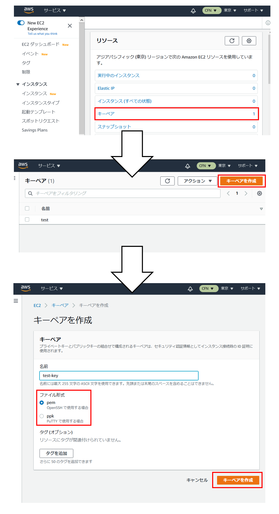

# 【事前準備】AWS EC2キーペア作成
## 概要
ハンズオン内でEC2インスタンスにSSH接続するため，キーペアを用意します．  


## 注意事項
AWSに登録していない方は，[こことか](https://aws.amazon.com/jp/register-flow/)参考にして作成し，MFAやらIAMユーザ作成やら諸々の初期設定をしておいてください．

---

## 手順
1. [AWSマネジメントコンソール](https://console.aws.amazon.com/console/home)からEC2管理のトップページに移動し，以下の画像の通りキーペアを作成します．  
名前とタグは任意，ファイル形式は自分が利用する方を選択 (pemの方が多いかと)．  
作成時に秘密鍵をダウンロードし，任意のフォルダにおいてください．[ここ]({{ site.github.repository_url }})でDLしたソースコードとまとめて置いておくと楽 (ちゃんと管理したい人は適宜やってください)．  

1. WSL/Linux/Mac利用の場合，DLした秘密鍵のパーミッションを次のコマンドで変更．  
```console
chmod 400 <自分がつけた名前>.pem
```

## その他
ハンズオンでは，YAML形式のテキストファイルを編集します．  
メモ帳でも実施できますが，以下2点が可能なエディタを用意するとはかどると思います．  
ちなみに[VS Code](https://code.visualstudio.com/ "Visual Studio Code - Code Editing. Redefined")派です．
- 文字列検索
- インデントの折り畳み

<br>

## 次のステップ：[AWSにおけるインフラ管理]()
気が向いたら書きます．
<br><br>
