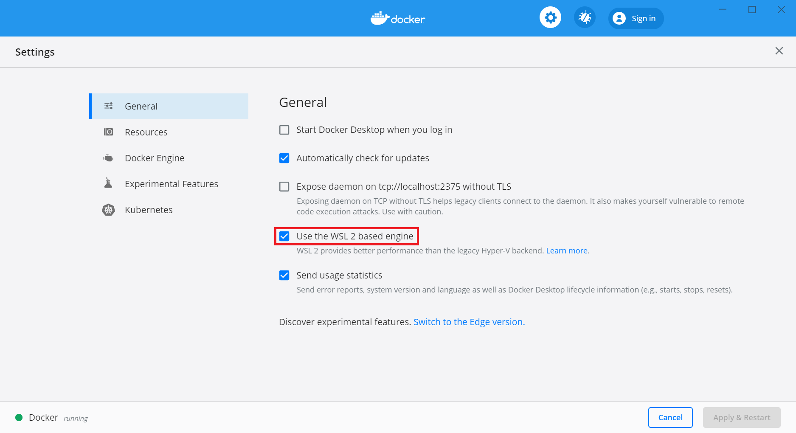
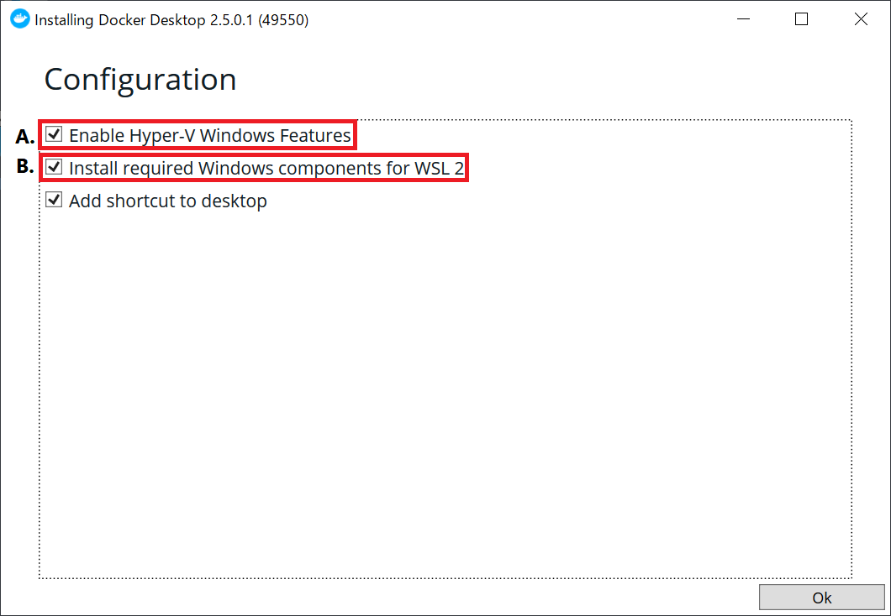
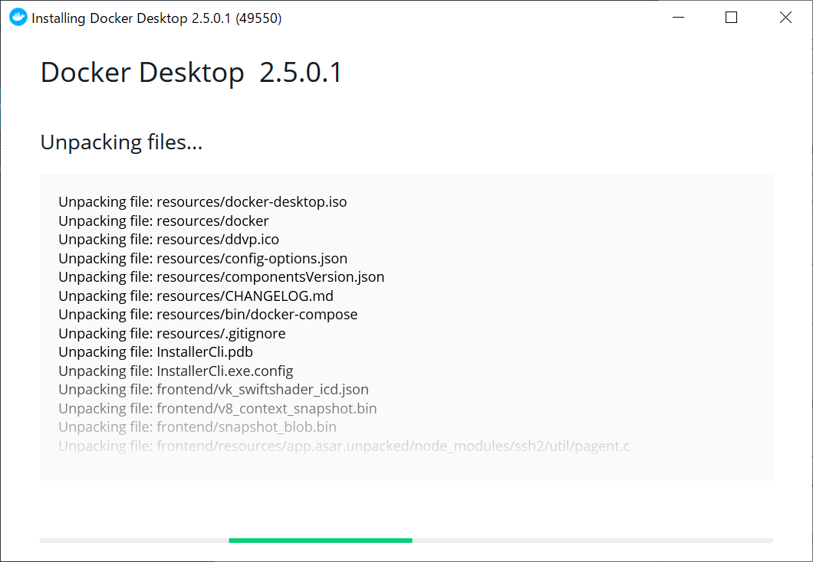
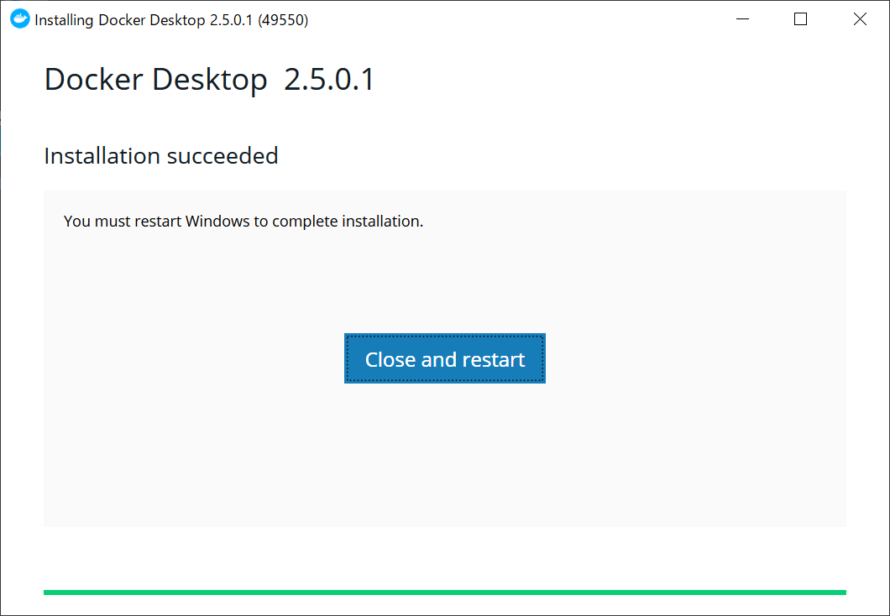
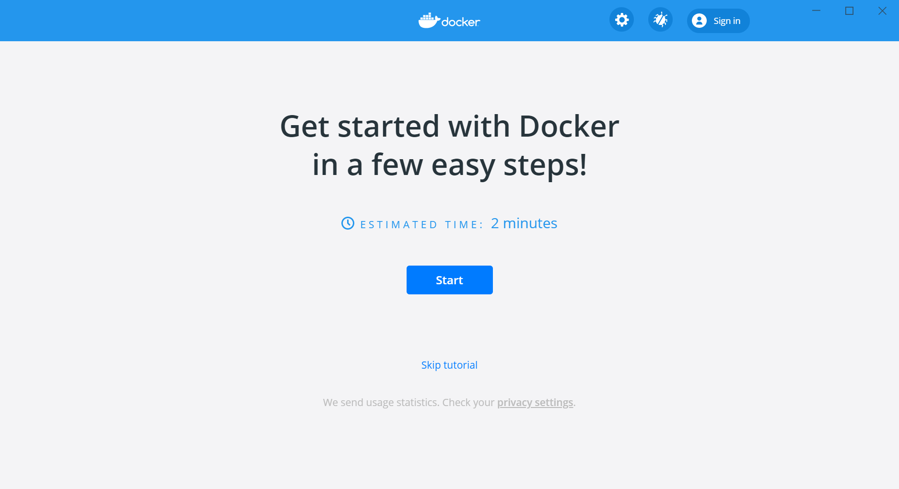

# 【事前準備】Docker for Windowsのインストール
## 概要
Windows公式の手順でWSL2を有効化後，Dockerの公式リポジトリからインストーラをダウンロード，インストールするだけの簡単な作業です&thinsp;[^1]．手順は[こちら](#手順)．

[^1]: Dockerの公式サイトでは[Win10&nbsp;Home](https://docs.docker.jp/docker-for-windows/install-windows-home.html)と[その他エディション](https://docs.docker.jp/docker-for-windows/install.html)でインストールページが分かれていますが，WSL2/Hyper-V選択の違いだけであり，手順は共通です．

## 想定環境 (再掲)
- ローカル端末
  - OS：Windows 10 **64bit**版 各種エディション
  - OSバージョン：**1903** (OSビルド **18362.1171**) 以降
  - アカウント権限：任意
  - その他：WSL2 or Hyper-Vの有効化が必要

## 注意事項
- 一般アカウントでの利用
  - ローカル管理者権限を持っていない標準ユーザーアカウント（以下，一般アカウント）での操作も可能ですが，インストール後，ローカルグループに当該一般アカウントを追加する必要があります．詳しくは[こちら](#一般アカウント利用)．
  - インストール及びグループへのアカウント追加にはローカル管理者権限が必要．
- WSL2とHyper-Vの選択
  - Docker for WindowsではWSL2 or Hyper-Vをバックエンドで利用します．
  - 速度・リソース消費の観点から**WSL2**がお勧めです．
    - ただし，WSL2の場合，アカウント間でのコンテナやイメージの共有不可．
  - いずれも利用できる環境であれば，インストール後，いつでも切り替え可能&thinsp;[^2]．
    - Win10 Homeの場合，そもそもHyper-Vを利用できないため，WSL2一択．
    - ただし，WSL2を有効化できるのは，現時点でOSバージョン1903以降．

[^2]: 画面上部の⚙️から設定画面を開き，赤枠部のチェック有無で切り替えられます．

---

## 手順
### WSL2を利用する場合
1. [MS公式サイト](https://docs.microsoft.com/ja-jp/windows/wsl/install-win10 "Windows 10 用 Windows Subsystem for Linux のインストール ガイド - Microsoft Docs")を参考に，WSL2をインストール・有効化する．

### 共通
2. [Docker公式のDocker Hubリポジトリ](https://hub.docker.com/editions/community/docker-ce-desktop-windows "Docker Desktop for Windows - Docker Hub")からインストーラをダウンロードします．  
※2021/3/2現在の最新ver. は3.2.0，下記画像はver. 2.5.0.1の時のもの．
1. 上記インストーラを実行します． (要管理者権限)
1. Hyper-Vを利用する場合は **A.** を，WSL2を利用する場合は **B.** を選択します&thinsp;[^3]．あとはOKを押してインストール完了です．  
一般アカウントで利用する場合，このタイミングで[一般アカウント利用](#一般アカウント利用)を実施します．  



1. インストール完了後，PCを再起動します．
1. 再起動後，Docker for Windows (Docker Desktop) を立ち上げてみて，特にエラーが出なければインストール成功です．  
  
1. Dockerの操作をWSLから行う場合，パスが通った場所にdocker/docker-compose (のリンク) があるか確認し，適宜シンボリックリンクを張ってください．  
```console
# WSL上 (CMD, PSの場合は不要)
# パスが通っているか試す．"/usr/bin/docker"のように返ってくればOK．
which docker
which docker-compose
# なにも返ってこない場合，以下でシンボリックリンクを張っておく．
sudo ln -s /mnt/wsl/docker-desktop/cli-tools/usr/bin/docker /usr/bin/docker
sudo ln -s /mnt/wsl/docker-desktop/cli-tools/usr/bin/docker-compose /usr/bin/docker-compose
```
1. 最後に，下記コマンドでdockerのバージョン確認と動作確認をして終了です．  
動作確認が成功した場合，次の文言を含むメッセージが表示されます．  
`Hello from Docker!`  
`This message shows that your installation appears to be working correctly.`  
```console
# WSL, PS, CMDのいずれかで実行
docker verion
docker-compose version
docker run hello-world
```
<br>

[^3]: 両方チェックしても問題ありません．


### 一般アカウント利用
Docker for Windowsを利用したい一般アカウントをdocker-usersグループに追加します．下記コマンドを管理者権限のcmd or PowerShellにて実施してください．  
(「コンピュータの管理」からGUI操作でもOKです．)  
```powershell
# CMD or PS上
net localgroup docker-users <利用するアカウント名> /add
```
<br>

## 次のステップ：[コンテナ操作の基本とコンテナライフサイクル]()
次回は，実際にコンテナを操作し，代表的な`docker`コマンドを確認します．  
そして一通りの操作後，"コンテナの作成 ~ 廃棄；コンテナライフサイクル" と`docker`コマンド，コンテナステータスとの関係についてみていきます．
<br><br>


### 注釈
